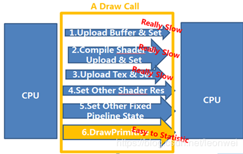

# 	Draw Call

$\color{#00AA22}{DrawCall}$从字面上理解是一次CPU对GPU的指令调用，如OpenGL 中的glDrawElements 命令或者DirectX 中的DrawlndexedPrimitive命令，实际$\color{#00AA22}{DrawCall}$指的是Cpu调用Gpu完整的图像绘制的一整个操作(从数据检验设置状态切换最后在渲染调用)，并非单一有一个调用指令。

网上查询关于UE的一个DrawCall行为:

调用Gpu图形绘制接口本身不是太过于消耗性能的事件，$\color{#00AA22}{DrawCall}$之所以会成为优化性能指标是因为每个$\color{#00AA22}{DrawCall}$代表需要用Cpu需要预先处理的一些设置，依据官方文档Cpu预先处理的设置包括:

1.渲染状态变更(Material.SetPass)

2.

https://docs.unity3d.com/Manual/optimizing-draw-calls.html

下面具体分析下

总结:

实际上$\color{#00AA22}{DrawCall}$包含的优化内容不单一只有batcher，对于单一Cpu调用GPU指令信号并非主要消耗，$\color{#00AA22}{DrawCall}$准确来说是渲染调用顺序的执行，而渲染调用顺序对于渲染不透明物体时候渲染效果的正确性起关键作用，因此对于非透明物体和透明物体的$\color{#00AA22}{DrawCall}$优化偏向不一样。

1.对于非透明物体完全可以以最低$\color{#00AA22}{DrawCall}$，最低Cpu操作优化

2.对于透明物体着重优化器状态切换的消耗，$\color{#00AA22}{DrawCall}$要在保证渲染正确情况下减少

关于UE对需要优化DC的建议原因

## Why should I have less draw calls?

It’s not about draw call itself, it’s about how computers handle it. X number of triangles are transferred to GPU per draw call, and the same rendering state will be applied to these triangles. So for example, if there was the same number of draw calls, it is faster to transfer 1,000,000 tries one time than 100 tris 1000 times. Because GPU has to stop and wait for CPU to transfer next set of information.

Simply put, let’s say you have \$100 at bank and you want to bring back home. It is faster to withdraw \$100 at once than to withdraw \$1 each time and having to go back and forth from home and bank many times.

