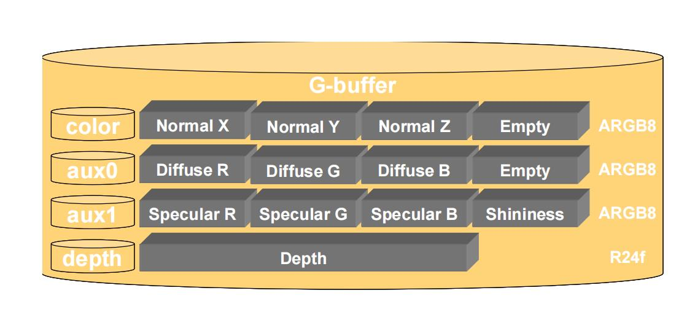

# Deferred Rendering

####  	概念

​	参考https://zhuanlan.zhihu.com/p/28489928

​	延迟渲染理念实际上是分离处理，是把渲染过程分成两部分来处理，

​	1.预先渲染出场景到屏幕上的数据

​	该步骤需要MRT(Multiple Render Targets)功能，可以把复数数据写入G-Buffer中，区别与普通将颜色写入纹理/屏幕中，G-buffer指将颜色、法线、空间坐标等数据写入的纹理空间

​	说到底就是G-Buffer（几何缓存区）指DeferredRendering第一阶段存储颜色、法线、高光颜色、深度等内容的数据区，该功能由于要向复数个RT数据结构写入数据，所以需要Multiple Render Target功能，N卡2004年推出的shader3.0后支持（MRT），Opengl在Opengl3.0 以后支持，就是android4以后支持，所以当前（2022年）可以说国内的玩家设备基本都支持，不支持也基本在10年前上下的设备

​	2.对屏幕上的数据做着色运算处理

​		获取到G-Buffer数据既可以开始全屏处理光照，屏幕空间技术等效果获得最终渲染效果

#### 	相关概念片

###### 		MRT(multi-target Rendering)

​		参考：https://copyfuture.com/blogs-details/20201012184514587ioi81tjxzbes5ir

###### G-Buffer 

​		参考：https://baike.baidu.com/item/G-Buffer/7250053?fr=aladdin

#### 	优化技巧

##### 		G-Buffer压缩

​	参考：https://zhuanlan.zhihu.com/p/126345392

##### 		分块处理屏幕灯光

#### 	实现

##### 		UnityURP 实现 延迟渲染

​		关联基础相关内容：

​		参考https://zhuanlan.zhihu.com/p/401602488

​		URP：

#### 	使用建议

