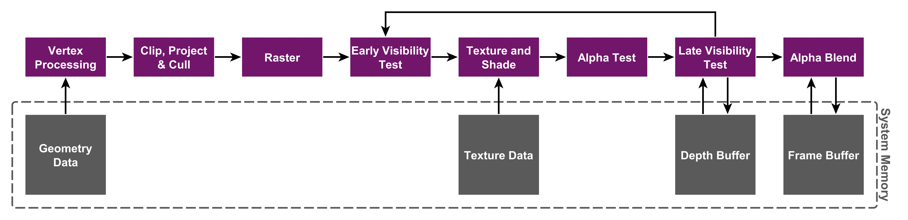
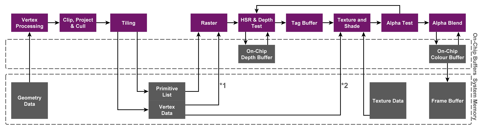

# 	Pipeline

##### 渲染管线

​	指渲染数据渲染到屏幕的过程，一般模型数据到屏幕需要经过以下过程：

​	CPU阶段(准备数据)->几何阶段(顶点数据换算到屏幕空间,准备光栅前数据)->着色阶段（光栅化到写入屏幕像素点）

​	分细过程其实就是：

​	数据准备然后调用DrawCall->模型空间->世界空间->裁剪空间->屏幕空间 (这后面还有曲面细分等可操作阶段)->光栅化(三维数据转二维)->着色计算->深度测试->	透明测试->模板测试->写入屏幕backframebuffer

​	以上是一般流程

##### 管线主流

​	现代主线主流渲染管线分为Forward,Deffered两种，也可以自定义一些渲染管线

###### Forward/Forward+

​	Link : https://github.com/MXUnity/GameDevelopment/tree/main/Assets/Pipeline/Forward

###### Deffered Rendering

​	Link : https://github.com/MXUnity/GameDevelopment/tree/main/Assets/Pipeline/Deferred

​	GPU架构参考：https://zhuanlan.zhihu.com/p/112120206，

​	实际上按照GPU架构渲染过程其实并不是一直保持上面的流程模式，因为实际上主要渲染架构TMR主要走上面流程，TMR每次Drawcall都会进行以下流程

##### TMR

​	移动端或者带电源的主机一般都是使用TBR渲染架构，为了减少带宽消耗，进而减少功耗，通过先缓存顶点数据，通过光栅化前做一次Early-z(进行一次顶点遮挡剔除)，减少实际在着色阶段运算量以及会系统内存读写数量，通过小片段的On-Chip来缓存数据，可以提高读写速度和减少能耗

TBDR是PowerVR(苹果所使用的GPU)提出申请专利的，实际是TBR的优化而来， 这个D其实是增加了下面光栅化后的深度剔除，顶点剔除其实还是有重叠的overdraw，光栅化后的剔除能保证精确去除overdraw，把着色阶段运算量降到最低。

##### TBDR/TBR

##### 总结

由于上面GPU架构区别可以得出以下结论：

###### TBR/TBDR总结

带电源体积小的移动设备因为体积和能耗问题使用TBR架构，那么同时带来的问题就有

1：顶点压力，因为要光栅前要缓存顶点数据切片作为后面剔除的依据，读写过程产生带宽占用，所以移动设备同屏顶点数最好不要超过20W，有人测试100w顶点数就算高端移动（2021年）设备也会触发瓶颈

2：MSAA以及延迟渲染管线都会给TBR带来比较大的压力，因为数据量变大使得On-Chip能缓存的量就缩水，会导致比不做msaa的向前渲染管线切片更多，带宽压力大，同时也导致一个单位时间GPU需要处理的切片数变多了，大大提高了一帧内GPU的耗时

3：体积小也就带着能带的运算逻辑单元少，处理性能不如主机PC运算，有时候读图的带宽压力比运算低，在PC或主机可以用运算替代读图减少带宽，真机有些时候就要读图替代运算减少运算

4：AlphaCut会打断Early-z流程，所以AlphaCut有时候性能消耗比AlphaBlend高，不过也要看先渲染AlphaCut剔除了多少OverDraw，所以实际情况并非AlphaCut比AlphaBlend消耗大

###### TMR总结

1：前向渲染会有很多overdraw,需要靠程序员自己剔除，但是延迟渲染在IMR架构就很合适

2：处理直接不会出现AlphaCut性能比AlphaBlend性能低奇怪的情况

3：实际不考虑功耗IMR更快更直接

