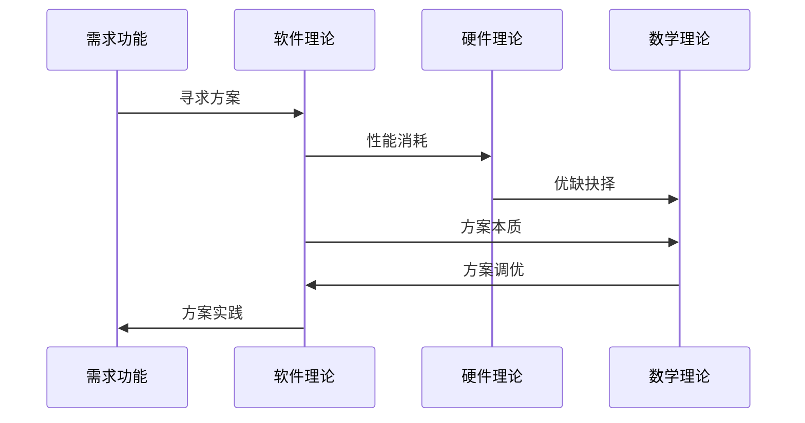

# Catalogue

## Introduction

​	当前状态属于每天好好学习渲染效果，研读各种渲染相关文章，尽量自己实践把各种效果实践组成自己的一套渲染架构,往后学好数学，英文，硬件理论以及软件理论

​	当前研习方式

优化总结：游戏的运行效率重点在于均衡调用硬件，在细致到各种硬件厂商定制不同优化方案

## Rendering

### 		[Pipeline](https://github.com/MXUnity/GameDevelopment/tree/main/Assets/Pipeline) 

### 			Postprocessing

### 	SSS

### 		PBR

## Animation

## 热更新

​	Xlua

​	ILRuntime

## 资源管理

## 加载

## 加密

## 工具

